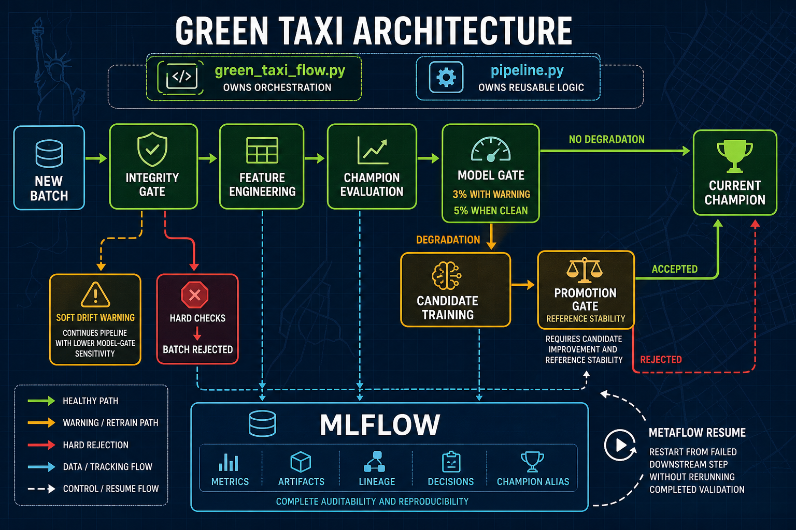

# 🚕 Green Taxi MLflow Project


Production-oriented batch monitoring and retraining workflow for NYC green taxi tip prediction. The system watches incoming batches, validates data quality, evaluates the registered champion model, retrains when performance degrades, and promotes a stronger candidate through MLflow Model Registry.

> **Disclaimer:** This project was developed and tested in a macOS environment. Other operating systems may require additional setup or dependency adjustments.

## ✨ What This Repo Demonstrates

- Metaflow orchestration for repeatable batch workflows
- MLflow tracking, artifact logging, dataset lineage, and model registry aliases
- Hard data-quality gates plus NannyML drift checks
- Champion/candidate evaluation with explicit promotion criteria
- Reproducible local execution, tests, and operational runbooks

## 🏗️ Architecture



The project has three primary architectural components:

- `green_taxi_flow.py` owns Metaflow orchestration, branching, and recovery boundaries.
- `src/pipeline.py` owns reusable data validation, feature engineering, modeling, evaluation, and registry logic.
- MLflow is the system of record for metrics, artifacts, dataset lineage, decisions, model versions, and the `@champion` alias.

For design rationale, operating boundaries, failure handling, and the production roadmap, see [`docs/design.md`](docs/design.md) and [`docs/architecture.md`](docs/architecture.md).

## 🔄 Flow Steps


1. **Start** — Initialize run state, configure MLflow tracking, and connect to the model registry.
2. **Load data** — Read the incoming TLC batch and the optional reference batch. During bootstrap, the incoming batch also acts as the reference.
3. **Integrity gate** — Reject unsafe data with missing columns, invalid timestamps, impossible durations, severe target missingness, or excessive range violations. NannyML drift findings remain non-blocking warnings.
4. **Feature engineering** — Filter the modeling population and deterministically produce the shared feature schema for reference and batch data.
5. **Load champion** — Resolve `models:/green_taxi_tip_model@champion`. If no champion exists, train and register the initial model from the reference data.
6. **Model gate** — Evaluate the champion on both datasets. Retraining starts when batch RMSE degradation exceeds 3 percent with an integrity warning or 5 percent for a clean batch.
7. **Candidate training** — When required, train a candidate on the combined reference and current batches, then evaluate it on both populations.
8. **Promotion gate** — Promote only when candidate batch RMSE improves by more than 1 percent and reference RMSE regresses by less than 5 percent. Otherwise, retain the current champion.
9. **End** — Record the final decision. MLflow retains metrics, artifacts, dataset lineage, prediction outputs, model versions, and gate rationale throughout the run.

The workflow is implemented in `green_taxi_flow.py`. Reusable data, validation, feature, model, and registry logic lives in `src/pipeline.py`.

## 📁 Repository Layout

```text
.
├── configs/                  # Runtime defaults and quality gate thresholds
├── data/raw/                 # Versioned sample TLC parquet files
├── docs/                     # Architecture and operating notes
├── green_taxi_flow.py        # Metaflow monitoring workflow
├── scripts/                  # Local utility scripts
├── src/
│   └── pipeline.py           # Reusable pipeline module
├── tests/                    # Unit and flow-level tests
├── environment.yml           # Conda environment
└── pyproject.toml            # Python package and test configuration
```

## 🚀 Quick Start

Create the environment:

```bash
conda env create -f environment.yml
conda activate taxi-tip-ops
python -m pip install -e .
```

Download the sample operating batches:

```bash
./scripts/download_tlc_data.sh
```

Start MLflow in a separate terminal:

```bash
mlflow server --workers 1 --port 5000 \
  --backend-store-uri sqlite:///mlflow_tracking/mlflow.db \
  --default-artifact-root mlflow_tracking/mlruns
```

Bootstrap and evaluate the champion:

```bash
python green_taxi_flow.py run \
  --batch-path data/raw/green_tripdata_2020-01.parquet
```

Evaluate a shifted batch and trigger retraining when the gate requires it:

```bash
python green_taxi_flow.py run \
  --ref-path data/raw/green_tripdata_2020-01.parquet \
  --batch-path data/raw/green_tripdata_2020-04.parquet
```

Open the MLflow UI at `http://localhost:5000` and inspect experiment `taxi_tip_monitoring`.

## 🛡️ Model Governance

A candidate is promoted only when all gate conditions pass:

- The batch passed hard integrity checks.
- Evaluation metrics and dataset lineage were logged.
- Candidate batch RMSE improves on the champion by at least 1 percent.
- Candidate reference RMSE does not regress by more than 5 percent.

Promotion updates the MLflow `@champion` alias on `green_taxi_tip_model`. Rejected candidates are still registered with validation tags so there is an audit trail.

## 🧪 Testing

```bash
python -m pytest
```

Run lint checks:

```bash
python -m ruff check green_taxi_flow.py src tests
```

The tests use synthetic taxi batches and local file-based tracking where possible, so they can run without the MLflow server for most validation paths.

## ⚙️ Operational Notes

- Local tracking state is written to `mlflow_tracking/` and ignored by git.
- The January, April, and August 2020 sample batches are versioned in `data/raw/`; other Parquet files remain ignored.
- Thresholds are documented in `configs/model_monitoring.yaml`; the workflow exposes promotion and tracking parameters at runtime.
- Batch prediction artifacts are logged to MLflow as `predictions.parquet` for post-run inspection.
